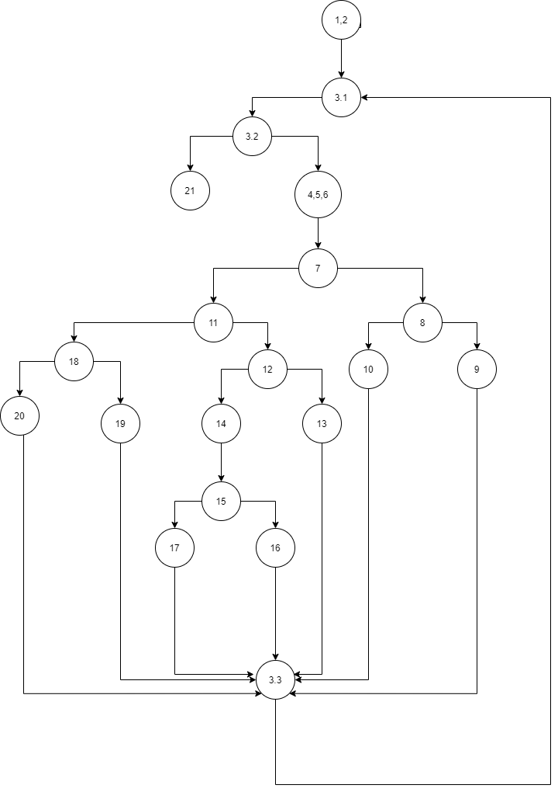

# Втора лабораториска вежба по Софтверско инженерство
## Дарко Џамбаски,бр. на индекс 185050

### Control Flow Graph

### Цикломатска комплексност
 
 Цикломатската комплексност на дадениот код ја пресметувам по формулата број на предикатни јазли +1 и таа е еднаква на 8.

### Тест случаи според критериумот Multiple condition

if (hr < 0 || hr > 24)

|Combination|Possible test case|Branch |
|-----------|------------------|-------|
|TF         |-9                |7,8-9  |
|FT         |38                |7,8-10 |
|FF         |21                |7-11   |

- За комбинација ТТ нема валиден тест случај па затоа оваа комбинација се отфрла.

if (hr < 24)
|Combination|Possible test case|Branch |
|-----------|------------------|-------|
|T          |13                |11-12  |
|F          |29                |11-18  |

if (min < 0 || min > 59)

|Combination|Possible test case|Branch    |
|-----------|------------------|----------|
|TF         |-2                |12-13  |
|FT         |78                |12-13  |
|FF         |47                |12,14-15      |

- За комбинација ТТ нема валиден тест случај па затоа оваа комбинација се отфрла.

 if (sec >= 0 && sec <= 59)

|Combination|Possible test case|Branch    |
|-----------|------------------|----------|
|TТ         |53               |15-16  |
|FT         |-17               |15-17  |
|TF         |88              |15-17  |

- За комбинација FF нема валиден тест случај па затоа оваа комбинација се отфрла.

if (hr == 24 && min == 0 && sec == 0)

|Combination|Possible test case|Branch    |
|-----------|------------------|----------|
|TТT         |24:0:0           |18-19 |
|TTF,TFF     |-15              |18-20 |
 - За комбинациите каде една или сите вредности се False условот нема да помине и ќе оди на следна инструкција.

### Објаснување на напишаните unit tests
- За Multiple condition го проверувам и враќам соодветен исклучок доколку условот е точен за внесеното време.
 
- За Every branch го проверувам и со дадено време кое влегува во четвртиот услов и соодветно задавам
 очекувана вредност во секунди која треба да ја врати во резултат за да провери тест случај. 

